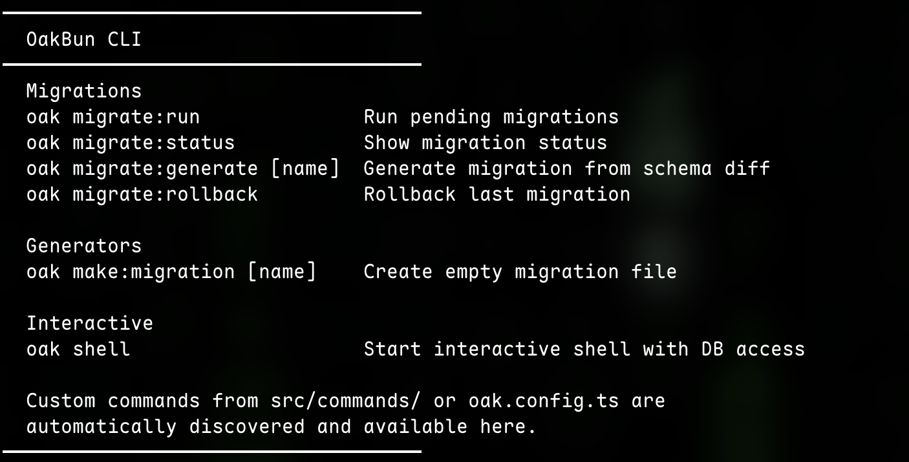
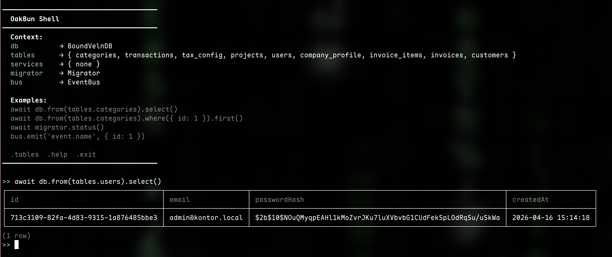

# OakBun

[](https://www.npmjs.com/package/oakbun)
[](https://github.com/SchildW3rk/OakBun)
[](./LICENSE)
[](https://bun.sh)

> Bun-native backend framework — modules, plugins, guards, services, and a CLI. No magic, just code.

OakBun is a structured backend framework built for [Bun](https://bun.sh). It gives you a clear, composable architecture: **modules** own routes, **plugins** extend the request context, **guards** gate access, **services** hold business logic, and the **ORM** speaks your schema directly. Everything is TypeScript-first with full type inference — no decorators, no reflection, no runtime surprises.

---

## Install

```bash
bun add oakbun
```

---

## The idea in 60 seconds

```ts
import { createApp, defineModule, definePlugin, dbPlugin } from 'oakbun'
import { z } from 'zod'

// 1. A module owns a group of routes
const usersModule = defineModule('/users')
  .get('/', {
    response: z.array(z.object({ id: z.number(), name: z.string() })),
    handler:  async (ctx) => ctx.json(await ctx.db.from(usersTable).select()),
  })
  .build()

// 2. A plugin protects a whole feature area with a single guard
const adminPlugin = definePlugin<object>('admin')
  .modules([usersModule])
  .guard((ctx) => {
    if (!ctx.req.headers.get('x-admin-token')) {
      return Response.json({ error: 'Unauthorized' }, { status: 401 })
    }
    return null
  })
  .extend(() => ({}))

// 3. Wire it together
const app = createApp()
  .plugin(dbPlugin({ adapter: 'sqlite', path: './db.sqlite' }))
  .plugin(adminPlugin)

app.listen(3000)
```

That's the entire mental model. Modules → Plugins → Guards → Handler. Each layer is opt-in and composable.

---

## Core concepts

### Modules

A module is a self-contained group of routes under a common prefix. It can have its own middleware, services, guards, and lifecycle hooks.

```ts
import { defineModule } from 'oakbun'
import { jwtPlugin }    from '@oakbun/jwt'
import { z }            from 'zod'

export const postsModule = defineModule('/posts')
  .plugin(jwtPlugin(process.env.JWT_SECRET!))   // populate ctx.jwtUser
  .use(PostService)                              // ctx.posts available in handlers
  .guard((ctx) => {
    if (!ctx.jwtUser) return Response.json({ error: 'Unauthorized' }, { status: 401 })
    return null
  })
  .get('/', {
    response: z.array(postSchema),
    handler:  async (ctx) => ctx.json(await ctx.posts.findAll()),
  })
  .post('/', {
    body:     z.object({ title: z.string(), body: z.string() }),
    response: postSchema,
    handler:  async (ctx) => ctx.json(await ctx.posts.create(ctx.body), 201),
  })
  .build()
```

### Plugins

Plugins extend `ctx` and can bundle multiple modules under a shared guard — one guard, all modules protected.

```ts
import { definePlugin, defineModule } from 'oakbun'

export const adminPlugin = definePlugin<object>('admin')
  .modules([
    defineModule('/admin/users').get('/', ...).build(),
    defineModule('/admin/posts').get('/', ...).build(),
    defineModule('/admin/settings').get('/', ...).build(),
  ])
  .guard((ctx) => {
    const token = ctx.req.headers.get('x-admin-token')
    if (token !== process.env.ADMIN_TOKEN) {
      return Response.json({ error: 'Unauthorized' }, { status: 401 })
    }
    return null
  })
  .extend(() => ({}))
```

> See [`examples/basic/src/plugins/admin.plugin.ts`](./examples/basic/src/plugins/admin.plugin.ts) for the full example shown below.


### Guard hierarchy

Guards run in a fixed order — outer tiers run first, inner tiers are skipped if a guard blocks:

```
plugin guard(s)   ← .guard() on definePlugin
  module guard(s) ← .guard() on defineModule
    route guard   ← guard: fn on individual route
      handler
```

### Services

Services encapsulate business logic and are injected into `ctx` by the module that uses them.

```ts
import { defineService } from 'oakbun'
import { UserModel }     from './user.model'

export const UserService = defineService('users')
  .use(UserModel)
  .define(({ UserModel, logger }) => ({
    findAll: () => {
      logger.debug('findAll')
      return UserModel.findAll()
    },
    findById: async (id: number) => {
      const user = await UserModel.findById(id)
      if (!user) throw new NotFoundError(`User ${id} not found`)
      return user
    },
  }))

// In your module:
defineModule('/users').use(UserService)
// → ctx.users.findAll(), ctx.users.findById(1), ...
```

### Schema & ORM

Define your tables with full TypeScript types. The ORM uses your schema directly — no query strings, no manual type casting.

```ts
import { defineTable, column } from 'oakbun'

export const usersTable = defineTable('users', {
  id:        column.integer().primaryKey(),
  name:      column.text().notNull(),
  email:     column.text().notNull().unique(),
  role:      column.text().notNull().default('user'),
  createdAt: column.timestamp().notNull().default('now'),
})

// Query
const users = await ctx.db.from(usersTable).where({ role: 'admin' }).select()
const user  = await ctx.db.from(usersTable).where({ id: 1 }).first()

// Insert / Update / Delete
await ctx.db.into(usersTable).insert({ name: 'Alice', email: 'alice@example.com' })
await ctx.db.from(usersTable).where({ id: 1 }).update({ role: 'admin' })
await ctx.db.from(usersTable).where({ id: 1 }).delete()
```

Supports SQLite, Postgres, and MySQL — swap the adapter in `oak.config.ts`, nothing else changes.

---

## The CLI

OakBun ships with `oak` — a CLI for migrations, an interactive shell, and custom project commands.



```bash
oak migrate:run              # run pending migrations
oak migrate:status           # show what's applied
oak migrate:generate [name]  # generate migration from schema diff
oak migrate:rollback         # roll back last migration
oak make:migration [name]    # create empty migration file
oak shell                    # interactive shell with DB access
oak <your-command>           # any custom command you define
```

### Interactive Shell

The shell gives you a live REPL with `db`, all your tables, and services loaded — great for debugging and one-off queries.



### Custom Commands

Drop a file in `src/commands/` and it's automatically available as `oak <name>`:

```ts
// src/commands/seed.ts
import { defineCommand } from 'oakbun'

export default defineCommand('seed')
  .description('Seed the database with initial data')
  .option('--email <email>', 'Admin email', 'admin@example.com')
  .action(async (args, ctx) => {
    const existing = await ctx.db.from(usersTable).where({ email: args.email }).first()
    if (existing) { console.log('Already seeded'); return }

    await ctx.db.into(usersTable).insert({ name: 'Admin', email: args.email })
    console.log(`Created admin: ${args.email}`)
  })
```

```bash
oak seed
oak seed --email admin@myapp.com
```

---

## Packages

| Package | Description |
|---|---|
| [`oakbun`](./packages/core) | Core framework — modules, plugins, guards, ORM, CLI |
| [`@oakbun/jwt`](./packages/jwt) | JWT plugin — adds `ctx.jwtUser` |
| [`@oakbun/auth`](./packages/auth) | Better Auth adapter |
| [`@oakbun/ws`](./packages/ws) | WebSocket plugin |
| [`@oakbun/logger`](./packages/logger) | Structured logger plugin |
| [`@oakbun/scalar`](./packages/scalar) | OpenAPI / Scalar UI |

---

## Documentation

Full docs are in [`/docs`](./docs). More real-world usage is in [`/examples/basic`](./examples/basic).

| Section | |
|---|---|
| [Getting Started](./docs/getting-started/01-installation.md) | Installation, quick start, project structure |
| [Core API](./docs/core/01-create-app.md) | createApp, defineModule, definePlugin, defineTable, defineService … |
| [Guards & Auth](./docs/guides/02-guards-and-auth.md) | Guard hierarchy, JWT, permissions |
| [SQL & ORM](./docs/sql/01-overview.md) | SelectBuilder, joins, migrations, query logging |
| [Plugins](./docs/plugins/01-plugin-system.md) | DB, JWT, Auth, WebSocket, rate limiting … |
| [CLI](./docs/cli/01-oak-cli.md) | `oak` commands, custom commands |
| [API Reference](./docs/api/01-ctx-reference.md) | Ctx fields, exported types |

---

## License

MIT — [René @ SchildW3rk](https://schildw3rk.dev)
